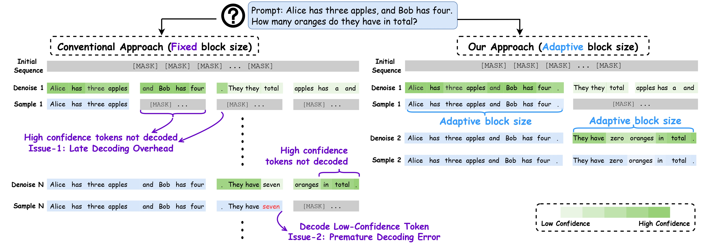
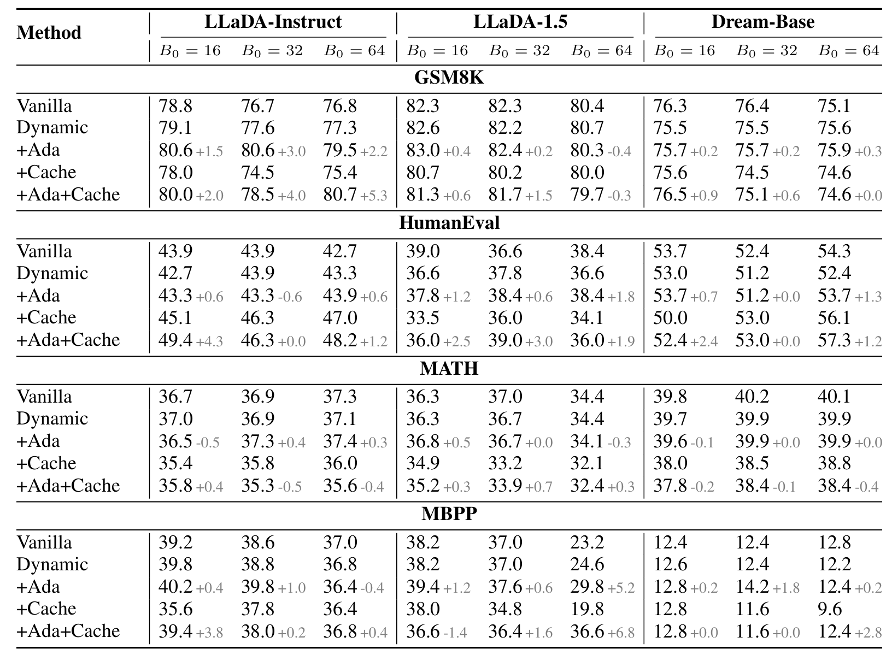

<div align="center">
  
</div>

# [ICLR 2026] AdaBlock-dLLM: Semantic-Aware Diffusion LLM Inference via Adaptive Block Size
[](https://github.com/lgxi24/AdaBlock-dLLM)
[](https://arxiv.org/abs/2509.26432)

**AdaBlock-dLLM** is an inference-time scheduling framework that improves generation quality for diffusion-based large language models (dLLMs). It targets the widely adopted semi-AR decoding paradigm and identifies two key bottlenecks: *late decoding overhead* and *premature decoding error*. Guided by confidence dynamics, we observe a locally stochastic volatility band (VB) that correlates with semantic context and adaptively predict block sizes to align decoding with semantic steps using delimiter-token confidence. AdaBlock-dLLM is the first work to explore semantic-aware, training-free adaptive block-size decoding for dLLMs.


## Project Structure

```
├── llada/      # AdaBlock-dLLM implementation for LLaDA
└── dream/      # AdaBlock-dLLM implementation for Dream
```

## Features
- **Addresses key bottlenecks of semi-AR decoding:**
  - **Late decoding overhead**: High-confidence tokens that fall outside a fixed block are unnecessarily delayed, wasting decoding steps.
  - **Premature decoding error**: Low-confidence tokens inside a fixed block may be finalized too early, increasing error propagation.
- **Semantic-aware adaptive block size**: Aligns block size with semantic steps, reducing premature commitments outside the active step and preventing a step from being split across iterations.
- **Training-free, plug-and-play**: An inference-time scheduling strategy that integrates seamlessly with existing inference frameworks (e.g., Fast-dLLM), achieving significant accuracy gain (up to 5.3% under comparable throughput) when combined with dual cache; requires no additional training or model changes.


<div align="center">
  
</div>

## Usage Guide

### 1. Installation

1. Clone the repository:
```bash
git clone git@github.com:lgxi24/AdaBlock-dLLM.git 
cd AdaBlock-dLLM
```

2. Create conda environment and install dependencies:
```bash
conda create -n adablock python=3.12
conda activate adablock
pip install -r requirements.txt
```

### 2. Demo

Run the AdaBlock generation demo:
```bash
cd llada
python generate_adablock.py
```

### 3. Evaluation

Please refer to the detailed evaluation guides for [LLaDA](llada/eval_llada.md) and [Dream](dream/eval_dream.md).

**Supported Models:**
- **LLaDA:** [LLaDA-8B-Base](https://huggingface.co/GSAI-ML/LLaDA-8B-Base), [LLaDA-8B-Instruct](https://huggingface.co/GSAI-ML/LLaDA-8B-Instruct), [LLaDA-1.5](https://huggingface.co/GSAI-ML/LLaDA-1.5)
- **Dream:** [Dream-v0-Base-7B](https://huggingface.co/Dream-org/Dream-v0-Base-7B), [Dream-v0-Instruct-7B](https://huggingface.co/Dream-org/Dream-v0-Instruct-7B)

**Supported Tasks:**
- **Math reasoning:** GSM8K (5-shot), MATH (4-shot)
- **Code generation:** HumanEval (0-shot), MBPP (3-shot)
- **Instruction following:** IFEval (0-shot)

**Hyperparameters Setting:**

| Parameter | LLaDA | Dream | Description |
|-----------|-------|-------|-------------|
| `threshold` | 0.9 | 0.9 | Token transfer confidence threshold |
| `delimiter_threshold` | 0.3 | 0.5 | Confidence threshold for delimiter tokens |
| `block_length` | 32 | 32 | Default block size (suggested: 16, 32, or 64) |
| `gen_length` | 512 | 512 | Total generation budget |

> **Note:** LLaDA uses a lower `delimiter_threshold` (0.3) because it is trained purely from scratch and exhibits lower variance within the volatility band. Dream, adapted from autoregressive models, shows substantially higher variance and thus requires a higher threshold (0.5). We provide detailed explanation of hyperparameter selection in our paper.

**Performance**
<div align="center">
  
</div>

## License

This project is licensed under the Apache License 2.0. See the [LICENSE](LICENSE) file for details.

## Citation

If you find this work useful, please cite our paper:

```bibtex
@misc{lu2025adablockdllm,
      title={AdaBlock-dLLM: Semantic-Aware Diffusion LLM Inference via Adaptive Block Size}, 
      author={Lu, Guanxi and Chen, Hao Mark and Karashima, Yuto and Wang, Zhican and Fujiki, Daichi and Fan, Hongxiang},
      year={2025},
      eprint={2509.26432},
      archivePrefix={arXiv},
      primaryClass={cs.LG},
      url={https://arxiv.org/abs/2509.26432}, 
}
```

## Acknowledgements

This codebase is inherited from [Fast-dLLM](https://github.com/NVlabs/Fast-dLLM), and the Dream implementation is inspired by [DPad](https://github.com/Crys-Chen/DPad). We would like to thank the authors of [LLaDA](https://github.com/ML-GSAI/LLaDA) and [Dream](https://github.com/HKUNLP/Dream) for open-sourcing the models, and the [lm-evaluation-harness](https://github.com/EleutherAI/lm-evaluation-harness) team for open-sourcing the evaluation framework.